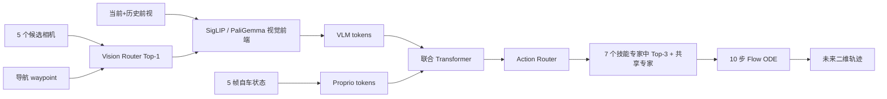

# DriveMoE Study：从零复现、理解与训练

这是一个以 **DriveMoE** 为唯一主线的中文学习仓库：从空间核算、环境和最小 Bench2Drive 数据开始，加载官方 DriveMoE Base 权重，在 3 个代表场景上做真实 open-loop 轨迹预测，再逐层解释 Drive-π0、Vision MoE、Action MoE、条件流匹配和两阶段训练。

> 本项目不执行完整训练，也不把 3 帧结果冒充论文指标。轻量 Demo 用于拆公式；真正的复现证据来自官方代码、官方权重和真实 Bench2Drive 图像。


## 当前复现范围

| 项目 | 本机实测/选择 |
|---|---|
| 系统与 GPU | Windows 11，2 × RTX 4090 D 48 GB |
| 上游代码 | `Thinklab-SJTU/DriveMoE@e39df2f` |
| 推理权重 | DriveMoE Base bf16，13,520,189,565 bytes |
| 最小数据 | LaneChange、ParkingExit、ConstructionObstacle 各 1 条路线 |
| 有效窗口 | 官方预处理 491；最终推理选 3 个场景样本 |
| 模型输入 | 当前/历史前视 + 5 个候选视角、5 帧状态、导航点、固定文本 |
| 模型输出 | 10 个未来二维 waypoint、视角 router、动作 router top-3 |
| CARLA | **open-loop 小样本不需要**；完整 closed-loop 才需要 CARLA 0.9.15 |

本机官方推理得到 3/3 有效输出，峰值显存约 **7.46 GiB**。ConstructionObstacle、LaneChange、ParkingExit 的单次轨迹 RMSE 分别为 **0.657 m、0.543 m、0.032 m**；这些数字只用于检查张量尺度和闭环完整性，不是数据集指标。两次独立 bf16 运行的主动作专家排序稳定，LaneChange 的视觉 top-1 在 `back` / `back_left` 间切换，因此本仓库明确区分“语义结果可重复”与“逐位浮点一致”。

## 最短路径

```powershell
git clone https://github.com/jcchen666888-cyber/drivemoe-study.git C:\E2E\DriveMoe
Set-Location C:\E2E\DriveMoe

# 公开资产：DriveMoE 权重、3 条路线、6 份标签
python scripts\download_assets.py --public

# PaliGemma 只下载 tokenizer（约 21 MiB），需先在 HF 接受 Google 条款
python scripts\download_assets.py --tokenizer

# 解压 3 条路线后直接生成 3 个与上游等价的窗口
python scripts\prepare_mini_data.py

# 单卡、bf16、官方权重推理
$env:CUDA_VISIBLE_DEVICES='0'
python scripts\run_minimal_inference.py
```

全新机器请从 [从零复现](docs/01_reproduce_from_zero.md) 开始。只学公式和路由：

```powershell
python demo\minimal_drivemoe_loop.py --self-test
```

## 学习路线

1. [范围、空间与验收](docs/00_scope_space.md)
2. [从零完成最小预测](docs/01_reproduce_from_zero.md)
3. [Bench2Drive 数据流水线](docs/02_data_pipeline.md)
4. [Drive-π0 与 DriveMoE 总架构](docs/03_architecture.md)
5. [Vision MoE：动态视角选择](docs/04_vision_moe.md)
6. [Action MoE：技能专家路由](docs/05_action_moe.md)
7. [条件流匹配与总损失推导](docs/06_math_and_losses.md)
8. [完整训练教学](docs/07_training_guide.md)
9. [易错点与诊断树](docs/08_troubleshooting.md)
10. [详细自测](docs/09_self_test.md)
11. [本机实验报告](docs/10_experiment_report.md)

## DriveMoE 的一条主线



推理时虽提供 7 张图，但模型只对当前前视、历史前视和 router 选中的 1 个候选视角运行昂贵视觉编码。发布配置有 7 个技能专家并激活 top-3，另有 1 个共享专家。

## 关键边界

- 本仓库的 3 样本结果只证明数据、权重、模型前向和路由输出打通。
- 论文的 Drive Score、Success Rate 来自完整 Bench2Drive closed-loop CARLA 评测。
- 发布权重 `horizon_steps=10`；上游 README 又要求公平 open-loop 对比使用 20。不要直接拿本结果和论文 Avg. L2 比。
- 论文文字、补充材料与发布代码在 expert 数、top-k、Stage 2 学习率上存在差异；教程分别列出，不混写。

## 上游与许可

- [DriveMoE 官方代码](https://github.com/Thinklab-SJTU/DriveMoE)
- [DriveMoE 论文](https://arxiv.org/abs/2505.16278)
- [Bench2Drive](https://github.com/Thinklab-SJTU/Bench2Drive)
- [DriveMoE 权重](https://huggingface.co/rethinklab/DriveMoE)
- [PaliGemma](https://huggingface.co/google/paligemma-3b-pt-224)

数据、权重、PaliGemma tokenizer 和上游代码遵循各自许可证；本仓库不重新分发大文件。
