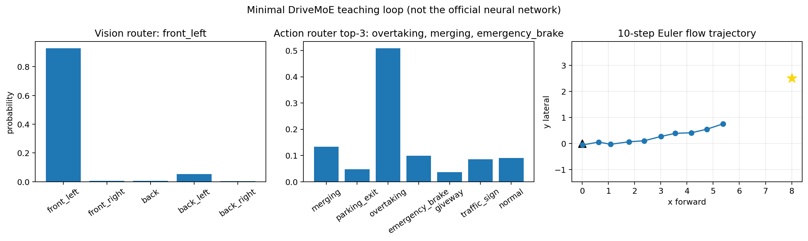
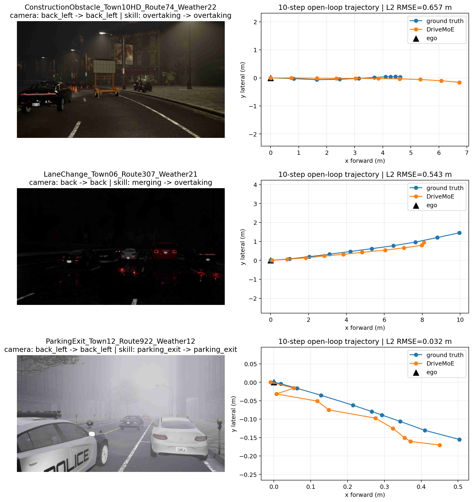

# 本机实验报告

## 环境与资产

- Windows 11，2 × RTX 4090 D 48 GiB，RAM 61.6 GiB；
- Python 3.10.20，PyTorch 2.5.1+cu124；
- DriveMoE upstream `e39df2f610b8ebc09efaab510abd65d3ebf38e55`；
- DriveMoE Base bf16 checkpoint：13,520,189,565 bytes，SHA256 `af97a1d8f415240320d9f0ac0f8a57cb15ba065cce5d8fbb41f2a90d8f6d6d4f`；
- PaliGemma 只使用约 21 MiB tokenizer，不下载其 3B 模型权重。

最终实测项目目录约 13.81 GiB，独立 Conda 环境约 6.53 GiB，合计 **20.34 GiB**，低于 50 GiB 授权上限。

PaliGemma 官方仓库是 gated repo。用户已接受许可，但本机没有 Hugging Face CLI token；为避免要求用户重复登录，本次只在逐文件比较官方仓库与公开镜像的 Git-LFS object ID 和字节数完全相同后传输 8 个 tokenizer 文件。实际内容仍是官方对象，教程的标准路线仍要求从官方仓库下载。

## 数据验证

| 路线 | 解压文件 | 解压 GiB | 选取场景 |
|---|---:|---:|---|
| ConstructionObstacle | 5,423 | 0.301 | overtaking |
| LaneChange | 3,857 | 0.161 | merging |
| ParkingExit | 5,829 | 0.230 | parking-exit |

上游官方转换得到 3 episodes、帧数 `[186,132,200]`，窗口化得到 491 samples。快速脚本的 3 个样本与对应上游 pickle 最大误差分别为 `4.77e-7`、`1.19e-6`、`1.91e-6`。另修复了 Windows 上 pickle 路径必须保存为正斜杠的问题，否则上游数据集用 `split('/')` 解析帧号时会失败。

## 教学闭环

```text
PASS: 5/5 mathematical and routing self-tests
camera=front_left
action_top3=overtaking,merging,emergency_brake
```



## 官方预测

运行条件：单张 RTX 4090 D、bf16、batch size 1、10 次 Euler 积分、10 个未来 waypoint。模型严格加载完整 stage-2 state dict；构建和加载约 38.2 s，峰值已分配显存约 7.46 GiB。模型加载后的单样本计时约 0.32–0.62 s。

| 样本 | Camera：真值 → Top-1 | Skill：真值 → Top-1 | Action Top-3 | 轨迹 RMSE |
|---|---|---|---|---:|
| ConstructionObstacle | back_left → back_left | overtaking → overtaking | overtaking, normal, emergency_brake | 0.657 m |
| LaneChange | back → back | merging → overtaking | overtaking, normal, merging | 0.543 m |
| ParkingExit | back_left → back_left | parking_exit → parking_exit | parking_exit, overtaking, normal | 0.032 m |



机器结果原始 JSON：[results.json](../outputs/official_mini/results.json)。

## 重复运行与数值边界

使用相同 seed、固定 cuBLAS workspace、关闭 TF32/Flash SDPA，并启用 PyTorch deterministic algorithms 后又独立运行一次。两次的 Action Top-3 顺序全部一致，Camera 语义大体一致；但 LaneChange 的 camera top-1 在 `back_left` 与 `back` 间切换，轨迹 RMSE 分别约为 `0.587/0.543 m`。这表明 Windows CUDA bf16 路径在低精度边界上不是逐位确定的。

因此本实验把“模型与路由语义稳定”作为工程验收，不宣称浮点数组 bitwise reproducible。若需要严格数值审计，应固定驱动、CUDA/cuDNN、GPU 型号与容器，并保存初始 Flow 噪声张量和完整输出。

## 结论边界

3 个样本覆盖 merging、parking-exit、overtaking，适合检查两个 router 与轨迹输出；不能估计 5/7 类准确率、平均 L2、Drive Score 或 Success Rate。发布 checkpoint 的 horizon 为 10，而上游公平 open-loop 比较说明要求 20；本结果不与论文 Avg. L2 直接比较。论文 closed-loop 结论仍需 CARLA 0.9.15 全协议验证。
